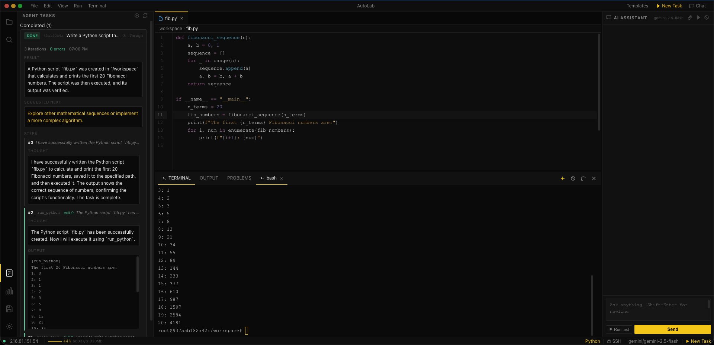
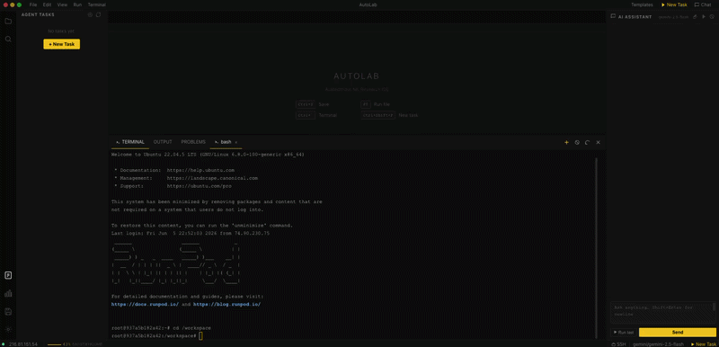

<h1> AutoLab</h1>

**An autonomous ML research IDE that runs in your browser, connects to your GPU pod over SSH, and lets an AI agent write code, run experiments, debug errors, and iterate — while you sleep.**

No cloud subscription. No sending your data to someone else's VM. Just point it at any SSH-accessible GPU, set your LLM API key, and run.

---

## What it looks like





---

## Why this exists

If you rent GPU pods (RunPod, Vast.ai, Lambda Labs, etc.), you probably have a workflow like:

1. SSH in, write a training script
2. Run it, watch it for a while
3. Fix something, run it again
4. Eventually close your laptop and hope for the best overnight

AutoLab replaces steps 1–4 with: describe what you want in plain English, hit Launch, close your laptop. The agent writes the code, runs it on your GPU, reads the output, fixes errors, and keeps going until it's done or genuinely stuck. In the morning you see what happened, what metrics it got, and what it suggests trying next.

It also gives you a full browser IDE so you can open files, edit code, and run terminal commands from your phone if you need to check in.

---

## Features

### Autonomous agent
- Describe a task in plain English — the agent figures out the code
- Runs Python and bash on your GPU pod over SSH
- Reads output, catches errors, fixes them, retries automatically
- **Auto-installs missing packages** — if a script fails with `ModuleNotFoundError`, it runs `pip install` and retries without asking
- Monitors long training runs at zero LLM cost (polls `ps`, tails logs — no API calls while your model trains)
- Notifies you on Slack, Discord, or email when done

### Browser IDE
- File explorer with right-click menus, drag-to-create, syntax-colored file icons
- CodeMirror 6 editor — Python, JavaScript, JSON, YAML, Markdown, Shell syntax highlighting
- Multiple tabs, dirty indicators, Ctrl+S to save
- Multi-terminal with real SSH PTY (tmux works, vim works, htop works)
- Works on **mobile** — simplified layout with bottom nav for checking in from your phone

### AI assistant (right sidebar)
- Ask about your code, get complete working scripts back
- Say "this file" or "fix this" — it automatically includes the current open file in context
- Say "workspace files", "gpu status", or "read /path/to/file" — it fetches live context
- Code blocks have Run, Copy, and Save buttons
- Upgrade chat responses to full autonomous tasks with one click

### Experiment comparison
- All completed tasks collected in a table with extracted metrics
- Auto-parses loss, accuracy, F1, etc. from agent output — no extra logging code needed
- Click any experiment for a detail view with files created, suggested next steps

### Checkpoint browser
- Lists all `.pt`, `.pth`, `.ckpt`, `.safetensors` files in your workspace
- Shows size and age, grouped by directory
- One-click to copy path, generate a `torch.load` snippet, or delete with confirmation

### GPU monitor
- Live sparkline in the status bar showing utilization over the last 36 seconds
- Click for a full panel: GPU util + VRAM graph, temperature, power draw
- Polls every 4 seconds while the IDE is open

### Task templates
- 8 pre-written task prompts for common ML workflows
- Fill in parameters (dataset path, architecture, learning rate, etc.) and launch
- Includes: train classifier, fine-tune LLM (LoRA), evaluate model, hyperparameter sweep, explore dataset, preprocess data, install requirements, profile GPU memory

### File diff viewer
- When the AI modifies a file that's open in the editor, shows a line-by-line diff before applying
- Accept or discard — you always see what changed

### Themes
- Dark (default), Dark+, Monokai
- Terminal colors update when you switch themes

---

## Quick start

### Prerequisites
- Python 3.10+ on your local machine
- A GPU pod accessible via SSH (RunPod, Vast.ai, Lambda Labs, your own server, etc.)
- An API key for at least one LLM provider (Gemini has a free tier)

### 1. Clone and install

```bash
git clone https://github.com/yourusername/autolab
cd autolab
pip install -r requirements.txt
```

### 2. Configure

```bash
cp .env.example .env
```

Open `.env` and fill in three things:

```env
# 1. Your GPU pod SSH details
SSH_HOST=216.81.151.54        # IP from your provider's dashboard
SSH_PORT=22                   # usually 22, RunPod direct is different (see below)
SSH_USER=root
SSH_KEY_PATH=~/.ssh/id_ed25519

# 2. Your LLM (Gemini is free to start)
MODEL=gemini/gemini-2.5-flash
GEMINI_API_KEY=AIza...

# 3. Where your code lives on the pod
WORKSPACE=/workspace
```

### 3. Check your setup (optional but recommended)

```bash
python preflight.py
```

This verifies SSH connects, your key exists, and your LLM is configured correctly — before you start the server.

### 4. Run

```bash
python server.py
```

Open **http://localhost:7860**

To access from your phone or another device:

```bash
ngrok http 7860
# or: ssh -R 7860:localhost:7860 your-other-machine
```

---

## SSH setup by provider

### RunPod

RunPod gives you two SSH options. Use the **direct IP** one, not the gateway:

```
# Dashboard shows something like:
ssh root@216.81.151.54 -p 15716     ← use this one

# NOT the gateway format:
ssh 54vdtrt8ao07md-64411f5d@ssh.runpod.io  ← don't use this
```

So your `.env` would be:
```env
SSH_HOST=216.81.151.54
SSH_PORT=15716
SSH_USER=root
SSH_KEY_PATH=~/.ssh/id_ed25519
```

Make sure you've added your **public key** (`~/.ssh/id_ed25519.pub`) to RunPod under *Settings → SSH Public Keys* before connecting.

### Vast.ai

Use the SSH command shown on your instance page. Port is typically in the 20000–30000 range.

### Lambda Labs

SSH details are on the instance page. Default port is 22.

### Any other provider

If it has an IP, a port, and accepts SSH key auth — it works.

---

## Supported LLM models

AutoLab uses [LiteLLM](https://docs.litellm.ai/docs/providers) under the hood, so any model it supports works. Set `MODEL=` in your `.env`:

| Provider | Model string | Free tier |
|---|---|---|
| Google Gemini | `gemini/gemini-2.5-flash` | ✓ |
| Google Gemini | `gemini/gemini-2.0-flash` | ✓ |
| Groq | `groq/llama-3.3-70b-versatile` | ✓ |
| OpenAI | `gpt-4o`, `gpt-4o-mini` | — |
| Anthropic | `claude-sonnet-4-5`, `claude-haiku-4-5` | — |
| Ollama (local) | `ollama/llama3`, `ollama/mistral` | ✓ (free, runs locally) |

**Recommended starting point:** `gemini/gemini-2.5-flash` — free tier is generous enough for most development use, and it's capable enough to run multi-step ML experiments.

Get your Gemini key at [aistudio.google.com/app/apikey](https://aistudio.google.com/app/apikey).

---

## Running your first task

Once the IDE is open:

1. Click **New Task** in the top bar (or press `Ctrl+Shift+P`)
2. Describe what you want in plain English. Be specific about paths, metrics, and what to save.
3. Click **Launch**
4. Watch the Output panel — each agent step streams in live
5. Close your laptop. You'll get a notification when it's done.

**Example task descriptions that work well:**

```
Train ResNet-18 on CIFAR-10. Use mixed precision, batch size 64, 20 epochs.
Target 90% val accuracy. Save the best checkpoint to /workspace/checkpoints/resnet18_best.pt.
Log train loss and val accuracy each epoch.
```

```
Fine-tune mistralai/Mistral-7B-v0.1 on the dataset at /workspace/data/train.jsonl.
Use LoRA (rank 16, alpha 32), learning rate 2e-4, 3 epochs, batch size 4.
Save the adapter to /workspace/lora_output/. Log loss every 10 steps.
```

```
My training script at /workspace/train.py is running out of GPU memory.
Profile it, identify the largest allocations, and apply gradient checkpointing
and mixed precision. Save the optimized version to /workspace/train_optimized.py.
```

**Tips for better results:**
- Give absolute paths (`/workspace/data/` not `./data/`)
- Specify what to save and where
- Mention the metric you care about
- For long runs, say "log progress to /workspace/run.log" so the agent can tail it

---

## Task templates

Don't want to write prompts from scratch? Click **Templates** in the top bar for 8 pre-built workflows:

- Train classifier (ResNet, EfficientNet, etc.)
- Fine-tune LLM with LoRA (HuggingFace + PEFT)
- Evaluate model on a test set
- Hyperparameter sweep over lr / batch size
- Explore and profile a dataset
- Preprocess and split raw data
- Install from requirements.txt
- Profile GPU memory usage

Fill in your paths and parameters, click **Use Template**, and it pre-fills the task modal.

---

## Checking in from your phone

When you access AutoLab on a screen ≤768px (mobile browser), the layout switches to a simplified view with a bottom navigation bar:

- **Status** — connection info, GPU utilization, running task count
- **Tasks** — list of all tasks with live status updates
- **Chat** — full AI assistant
- **Terminal** — real SSH terminal on your pod

This is designed for the "checking in at 2am" use case — you don't need to open a laptop.

---

## Notifications

Set these in `.env` to get pinged when a task finishes (or gets stuck):

**Slack or Discord:**
```env
WEBHOOK_URL=https://hooks.slack.com/services/T.../B.../...
# Discord also works — use a Discord incoming webhook URL
```

**Email (Gmail example):**
```env
NOTIFY_EMAIL=you@gmail.com
SMTP_HOST=smtp.gmail.com
SMTP_PORT=587
SMTP_USER=you@gmail.com
SMTP_PASSWORD=your-app-password   # use a Gmail App Password, not your account password
```

---

## Keyboard shortcuts

| Shortcut | Action |
|---|---|
| `Ctrl+S` | Save current file |
| `Ctrl+W` | Close current tab |
| `F5` | Save and run current file |
| `` Ctrl+` `` | Toggle terminal panel |
| `Ctrl+Shift+P` | New agent task |
| `Ctrl+Shift+F` | Search files |
| `Ctrl+Shift+E` | Focus file explorer |

---

## Agent tools

The agent can use these tools on your GPU pod. Each tool call is logged in the task detail panel so you can see exactly what it did:

| Tool | What it does |
|---|---|
| `run_python` | Write and execute a complete Python script |
| `run_bash` | Run a shell command in the workspace directory |
| `read_file` | Read any file on the pod |
| `write_file` | Create or overwrite a file |
| `list_dir` | List directory contents |
| `search_files` | Search files by name or content |
| `gpu_status` | Get GPU name, VRAM usage, utilization |
| `install_package` | Run pip install |
| `check_process` | Check if a process is still running (used for monitoring long jobs) |
| `tail_log` | Read the last N lines of a log file |

**How monitoring works:** When the agent starts a long training run, it doesn't keep calling the LLM every minute. Instead, it uses `check_process` (just reads from `ps`) and `tail_log` (just reads a file) to monitor progress — no API calls during the actual training. This keeps costs at a few cents per overnight run rather than dollars.

---

## Configuration reference

All settings go in `.env`. Copy `.env.example` to get started.

| Variable | Description | Default |
|---|---|---|
| `SSH_HOST` | IP or hostname of your GPU pod | — |
| `SSH_PORT` | SSH port | `22` |
| `SSH_USER` | SSH username | `root` |
| `SSH_KEY_PATH` | Path to your SSH private key | `~/.ssh/id_ed25519` |
| `WORKSPACE` | Working directory on the pod | `/workspace` |
| `MODEL` | LiteLLM model string | `gemini/gemini-2.5-flash` |
| `MAX_ITERATIONS` | Max agent steps per task | `25` |
| `TOOL_TIMEOUT` | Seconds before a tool call times out | `600` |
| `WEBHOOK_URL` | Slack/Discord webhook for notifications | — |
| `NOTIFY_EMAIL` | Email address for notifications | — |
| `UI_PORT` | Port to serve the UI on | `7860` |

---

## Project structure

```
autolab/
├── server.py              # FastAPI backend — all API routes
├── config.py              # Typed settings, reads .env
├── preflight.py           # Setup checker — run this first
├── requirements.txt
├── .env.example
├── orchestrator/
│   ├── agent.py           # Main agent loop, auto-install, monitoring
│   ├── tools.py           # SSH tool implementations (10 tools)
│   ├── memory.py          # Task log persistence to logs/*.json
│   └── prompts.py         # LLM system prompts
└── ui/
    ├── index.html
    ├── style/
    │   ├── theme.css      # CSS variables — Dark, Dark+, Monokai
    │   ├── main.css       # Layout and all components
    │   ├── editor.css     # CodeMirror 6 syntax highlighting
    │   └── mobile.css     # Mobile layout (≤768px)
    └── js/
        ├── app.js         # Bootstrap, resize handles, keybindings
        ├── editor.js      # CodeMirror 6, file tree, tabs
        ├── terminal.js    # xterm.js multi-terminal over WebSocket
        ├── chat.js        # AI assistant sidebar
        ├── tasks.js       # Agent task panel, SSE live streaming
        ├── experiments.js # Experiment comparison table
        ├── diff.js        # File diff viewer
        ├── gpu_monitor.js # GPU sparkline + detail panel
        ├── checkpoints.js # Checkpoint browser
        ├── templates.js   # Task template library
        ├── mobile.js      # Mobile view
        ├── search.js      # BFS file/content search
        ├── api.js         # All fetch calls
        ├── state.js       # Global app state
        ├── utils.js       # SVG icons, helpers
        └── notifications.js # Modals, toasts, context menu
```

---

## Compared to alternatives

|  | AutoLab | VS Code Remote SSH | Devin / Cursor Agents |
|---|---|---|---|
| Works from phone/browser | ✓ | ✗ | ✓ |
| Runs on your own GPU pod | ✓ | ✓ | ✗ |
| Autonomous overnight runs | ✓ | ✗ | ✓ |
| Free (just your API key) | ✓ | ✓ | ✗ ($$$) |
| Any GPU provider | ✓ | ✓ | ✗ |
| No local install needed | ✓ | ✗ | ✓ |
| Experiment history/comparison | ✓ | ✗ | ✗ |
| Checkpoint browser | ✓ | ✗ | ✗ |

The key difference from VS Code Remote: AutoLab runs entirely in the browser with no local VSCode install — you can connect from any machine or your phone. The key difference from Devin/Cursor Agents: your code and data stay on your own GPU pod, and you pay cents in LLM API costs rather than per-minute agent pricing.

---

## Troubleshooting

**SSH connection refused**
- Check that the IP and port in `.env` match exactly what your provider shows
- For RunPod: use the direct IP format (`ssh root@IP -p PORT`), not the gateway format
- Make sure your public key is registered with your provider

**CodeMirror editor shows plain text (no colors)**
- The editor loads syntax highlighting from CDN — you need an internet connection on the machine running the browser, not the pod
- If you're behind a strict firewall, the imports from `esm.sh` may be blocked

**Agent gets stuck on iteration 1**
- Usually means the LLM isn't responding — check your API key is set correctly
- Run `python preflight.py` to verify everything is configured

**"ModuleNotFoundError" in agent output**
- AutoLab automatically detects this and runs `pip install` — wait a moment and it retries
- If the package name differs from the import name (e.g. `PIL` → `pillow`), the agent will figure it out on the next iteration

**Task finishes instantly with 0 iterations**
- This is the duplicate task bug from earlier — make sure you're running the latest version of `server.py` and `orchestrator/agent.py`

**GPU monitor shows "No GPU"**
- `nvidia-smi` isn't available on the pod or the pod has no GPU
- CPU-only pods will show nothing in the GPU panel — everything else still works

---

## License

MIT — see [LICENSE](LICENSE)